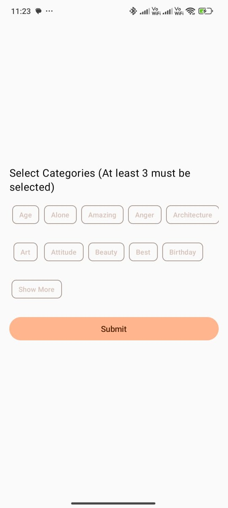
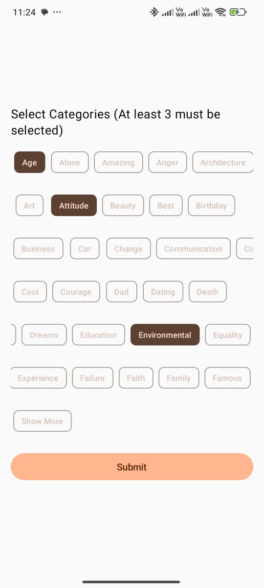
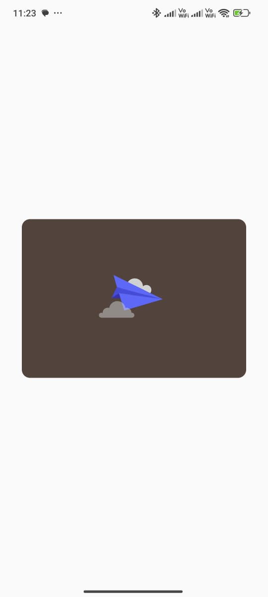
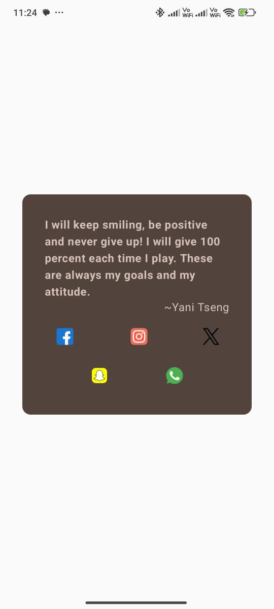

# SayIt - A Quote App


Welcome to **SayIt** – your daily dose of inspiration and motivation delivered right to your phone!

SayIt provides a beautifully designed interface to share daily quotes, allowing you to spread positivity and wisdom with your social network.

## Features

- **Daily Quotes:** Receive a fresh and motivational quote each day.
- **Customizable Categories:** Choose from various categories to get quotes that resonate with you.
- **Social Media Integration:** Share your favorite quotes directly to Facebook, Instagram, Twitter, Snapchat, and WhatsApp.
- **Edge-to-Edge UI:** Experience a modern, immersive design with edge-to-edge UI support.

## Screenshots






## Installation

### Prerequisites

Ensure you have the following installed:

- [Android Studio](https://developer.android.com/studio)
- [JDK 1.8](https://www.oracle.com/java/technologies/javase-jdk8-downloads.html)

### Clone the Repository

```bash
git clone https://github.com/arindhimar/SayIt.git
cd SayIt

# SayIt - Build and Configuration Guide

## Build and Run

1. **Open the Project in Android Studio:**
   - Launch Android Studio and open the `SayIt` project.

2. **Build the Project:**
   - Click on `Build` in the top menu.
   - Select `Rebuild Project` to compile the project.

3. **Run the App:**
   - Connect an Android device or start an emulator.
   - Click on `Run` in the top menu.
   - Select `Run 'app'` to deploy the app to the device or emulator.

## Configuration

- **API Key:**
  - Set up your API key for the quotes API by adding it to your `gradle.properties` file:

  ```properties
  API_KEY=your_api_key_here
